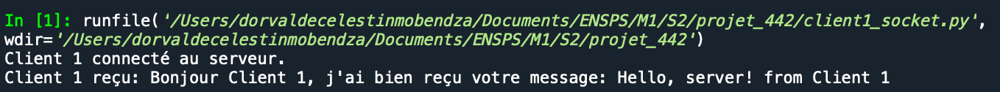
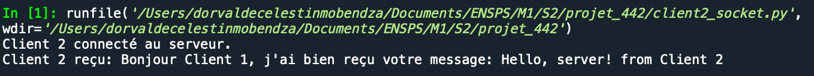
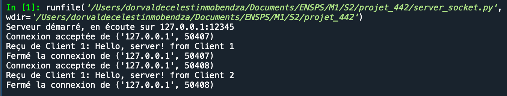
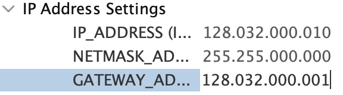

# Clients/Serveur TCP à l'aide de LWIP

Ce projet consiste réaliser une communication TCP entre la carte microcontrolleur STM32 (client) et un ordinateur (le serveur) à l'aide de l'API LwIP. 


# Première Partie : Communication local entre deux processus (clients) et un autre (serveur) sur la même machine 

Cette partie préliminaire consiste en une implémentation simple d'un serveur et de deux clients qui communiquent via TCP. 

Le serveur ferme automatiquement la connexion avec un client si aucune activité n'est détectée pendant 10 secondes.


## Fonctionnalités

- Serveur TCP qui écoute les connexions entrantes.
- Deux clients (Client 1 et Client 2) qui peuvent envoyer des messages au serveur.
- Le serveur ferme les connexions après 10 secondes d'inactivité.

## Serveur

Le serveur est implémenté en Python et utilise les sockets avec un mécanisme de timeout pour gérer l'inactivité.

 - Initialise le serveur socket en IPv4 (AF_INET) et TCP (SOCK_STREAM).
  ```python
  server_socket = socket.socket(socket.AF_INET, socket.SOCK_STREAM)
  ```
  
- Configure l'option SO_REUSEADDR pour réutiliser l'adresse et le port.
  ```python
  server_socket.setsockopt(socket.SOL_SOCKET, socket.SO_REUSEADDR, 1)
  ```

-  Le serveur  est configuré à l'adresse IP '127.0.0.1' et au port 12345, puis démarre l'écoute.
  ```python
  server_socket.bind((host, port))
  server_socket.listen()
  ```

- Utilise `select` pour surveiller plusieurs sockets avec un timeout de 10 secondes.
  ```python
  read_sockets, _, exception_sockets = select.select(sockets_list, [], sockets_list, 10)
  ```

- Vérifie l'inactivité des clients et ferme les connexions inactives depuis plus de 10 secondes.
  ```python
  if time.time() - last_active.get(client_socket, 0) > 10:
      client_socket.close()
  ```

- Accepte les nouvelles connexions et les ajoute à la liste des sockets et au dictionnaire des clients.
  ```python
  client_socket, client_address = server_socket.accept()
  sockets_list.append(client_socket)
  clients[client_socket] = client_address
  ```

- Reçoit les messages des clients, met à jour leur dernier temps d'activité, et envoie une réponse.
  ```python
  message = notified_socket.recv(1024)
  notified_socket.send(response_message.encode())
  ```

- Gère les exceptions en supprimant les sockets défaillants de la liste et en fermant les connexions.
  ```python
  sockets_list.remove(notified_socket)
  del clients[notified_socket]
  notified_socket.close()
  ```
Le serveur utilise maintenant select pour gérer plusieurs connexions de manière non bloquante.

## Les clients 

Les clients fonctionnent comme suit : 

- Ils parlent au serveur sur l'adresse '127.0.0.1' qui une adresse standard pour des communications loopback (avec le même hôte) et sur le port 12345 (port choisit au hasard, il doit juste être libre d'usage).
- Crée un client socket utilisant IPv4 (AF_INET) et TCP (SOCK_STREAM).
- Se connecte au serveur à l'adresse IP '127.0.0.1' ( adresse de loopback , cad avec le même hôte) et au port 12345.
- Affiche un message confirmant la connexion au serveur.
- Envoie le message 'Hello, server! from Client 1' au serveur.
- Reçoit une réponse du serveur et affiche la donnée reçue en la décodant.
```python

def client():
    host = '127.0.0.1'
    port = 12345

    with socket.socket(socket.AF_INET, socket.SOCK_STREAM) as s:
        s.connect((host, port))
        print("Client 1 connecté au serveur.")
        s.sendall(b'Hello, server! from Client 1')
        data = s.recv(1024)
        print(f"Client 1 reçu: {data.decode()}")
```
Ainsi, chaque client se connecte au serveur et envoie un message identifié. Le serveur écoute tous les clients connectés et répond à chacun d'eux individuellement, en indiquant explicitement à quel client il parle. 

## Résulatat des échanges 





# Deuxième Partie : Communication entre deux processus (clients) émulant par freertos à l'aide de la carte STM32 et un serveur correspondant au PC

## Configurations 

- Activer Freertos (ordonancement des tâches) et ETH (activation d'ethernet pour le support physique) sur STM32IDE (dans l'onglet : Middleware and software Packs/Connectivity)
- Activer Lwip (Middleware and software Packs) , et configurer une adresse ip fixe à la carte

- On Crée deux taches pour les deux clients.
- On fixe l'adresse ip du pc à "192.168.1.100" (choix arbitraire)
- On Crée un script python pour le serveur.

## Serveur 
Le code du serveur ne change pas, à l'exception de l'adresse ip qui devient celle qu'on a fixé à la machine.
## clients 

Ici le code change, car on programme les deux tâches en C. 

- On Crée un nom de client unique basé sur l'argument `arg`.
  ```c
  snprintf(client_name, 16, "Client %d", (int)arg);
  ```

- On initialise et crée un socket TCP.
  ```c
  sock = lwip_socket(AF_INET, SOCK_STREAM, 0);
  ```

- On configure l'adresse du serveur en spécifiant l'adresse IP et le port.
  ```c
  memset(&server_address, 0, sizeof(server_address));
  server_address.sin_family = AF_INET;
  server_address.sin_port = htons(SERVER_PORT);
  server_address.sin_addr.s_addr = inet_addr(SERVER_IP);
  ```

- On se connecte au serveur avec les informations configurées.
  ```c
  if (lwip_connect(sock, (struct sockaddr *)&server_address, sizeof(server_address)) < 0) {
      lwip_close(sock);
      vTaskDelete(NULL);
      return;
  }
  ```

- On envoie un message au serveur une fois la connexion établie.
  ```c
  lwip_send(sock, message, strlen(message), 0);
  ```

- On ferme le socket et termine la tâche.
  ```c
  lwip_close(sock);
  vTaskDelete(NULL);
  ```


